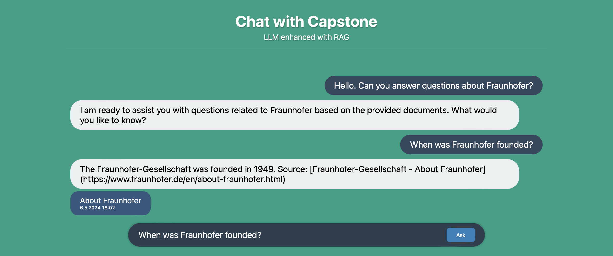
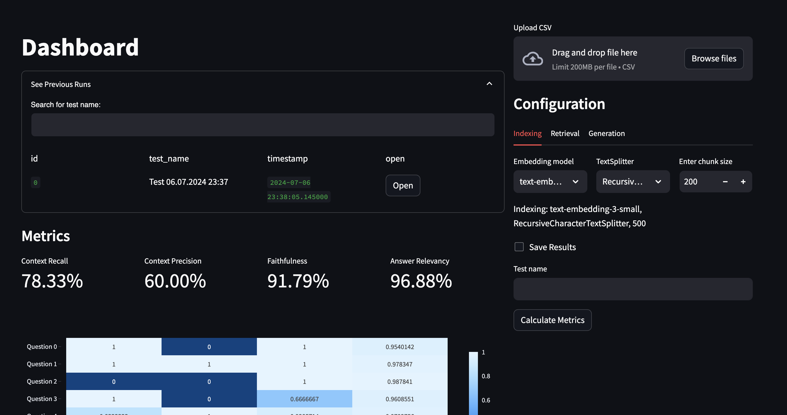

# RAG Pipeline

You can start the User Interface to interact with the RAG pipeline and a dashboard for evaluating the pipeline.

Main repository for RAG Pipeline.

```
.
├── README.md
├── app.py                                          # Flask server for frontend and api
├── .env.template                                   # Configuration file for the dashboard (template)
├── config.ini                                      # Configuration file for the pipeline
├── dashboard.py                                    # Dashboard to evaluate the RAG Pipeline
├── dashboard_utils.py
├── gen_evaluation.py
├── main_evaluation.py
├── rag
│   ├── fixtures                                    # All static data
│   │   └── prompts.py                              # Every prompt that is used for the chatbots
│   ├── functions                                   # Static methods
│   │   └── vector_indexing.py                      # Indexing, chunking, embedding and database creation
│   ├── models                                      # All classes
│   │   ├── chatbot.py                              # Different Chatbots
│   │   ├── databases.py 
│   │   ├── dataloader.py 
│   │   ├── evaluation.py                           
│   │   ├── generation_evaluation.py
│   │   ├── generation.py 
│   │   ├── guardrails.py
│   │   ├── retrieval.py
│   │   └── routing.py                              # Pipeline routers
│   └── pipeline.py                                 # The main pipeline and graph configuration
├── requirements.txt                                # Required python packages
├── templates                                       # HTML Templates for the frontend
│   └── index.html                                  # Frontend
└── test_cases
    └── routing
        ├── detect_rag_relevance_false.json
        ├── detect_rag_relevance_true.json
        ├── document_grading_false.json
        ├── document_grading_true.json
        ├── guadrail_pii.json
        ├── guadrail_work.json
        ├── hallucination_detection_false.json
        ├── hallucination_detection_true.json
        └── test_test.json
```

## Requirements

Python 3.11 or higher is required. Mac and Linux support are tested.

## Installation

Create a virtual environment.

```
python -m venv venv
source venv/bin/activate
```

Install the requirements.

```
pip install -r requirements.txt
```

# Setting up the pipeline

## Configuration

The pipeline has several configurable components through the adjustment of `config.ini`.

### Section [web]

You can specify the IP address and port used for hosting the web application for interacting with the pipeline through a User Interface.

### Section [ingestion]

You can specify the source and language to ingest the data from. Currently, local storage and cloud services including Azure Blob Storage and AWS S3 are supported. When choosing a specific cloud service, please provide with the necessary fields for establishing the connection.

- Azure Blob Storage: We support access to a container using shared access signatures (SAS). Please generate the SAS token for a specific container in your Azure portal and provide the URL.

- AWS S3: We support access to a S3 bucket through the S3 service client. Please provide with the user's access token and the region and the name of the bucket to connect to.

### Section [indexing]

You can specify the embedding and chunking methods for the indexing process in this section. 

When using multi-representation indexing, set `use_summaries` flag on and specify the preferred LLM to use for generating summaries for the document chunks. 

If you wish to persist the current embedding run in the vector database in a local directory for future usage, you can achieve this by setting `persist_current_vectordb` flag on and provide the directory path in `persist_directory`. Likewise, for future usage of the persisted database skipping the embedding process, you can set the `use_persist_directory` flag.

### Section [retrieval]

You can specify the preferred retrieval method and the reranker in this section.

When using `Multi-Query` or `Contextual Compression` retrieval methods, please specify the preferred LLM to use for generating multiple queries or compressing the documents.

### Section [chatbot]

In this section, you should specify the necessary parameters for LLM setup.
- If you have specified using `openai` in any other section, please provide an OpenAI key.
- If you have specified using `ollama` in any other section, please provide the API endpoint your local model is hosted at (normally, it is "http://localhost:11434/api/generate")

### Section [generation]

You can specify the preferred LLM to use for the generation process in this section.

### Section [routing]

You can specify the preferred LLM to use for the routers to make their decisions in this section.

### Section [guardrails]

You can specify if you would like to:

- Block personally identifiable information: using flag `block_pii`.
- Block queries unrelated to work tasks: using flag `block_not_work_related`.
- Anonymize sensitive information in the queries: using flag `anonymize_pii`.

and the specific method to de-anonymize.

You can specify the preferred LLM to use for these as well.

## Running the Pipeline UI

Start the User Interface with:

```
python3 app.py
```

Access via the defined URL in the config file. By default [http://127.0.0.1:5000/](http://127.0.0.1:5000/)



# Setting up the Dashboard

## Configuration

The dashboard is configured through the `.env` file, please create one using the `.env.template` and provide:

- `FIREBASE_API_KEY` for the authentication service.
- `ATLAS_URI`, `DB_NAME`, and `COLLECTION_NAME` are used to create a MongoDB to save the history of all evaluation runs.

## Running the Dashboard UI

To start the Dashboard for evaluation the RAG Pipeline:

```
streamlit run dashboard.py
```

